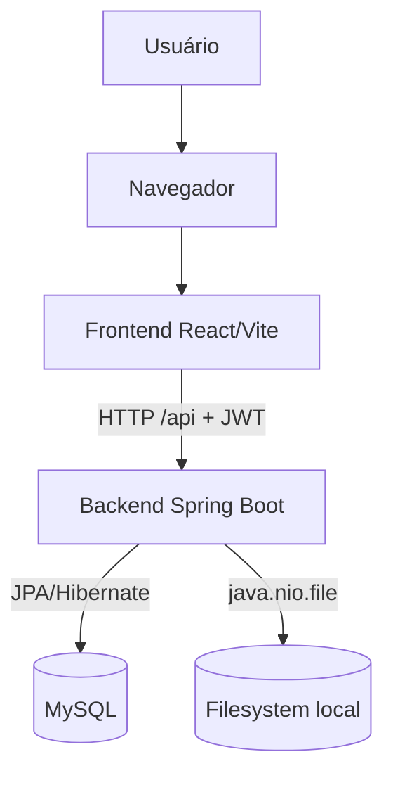
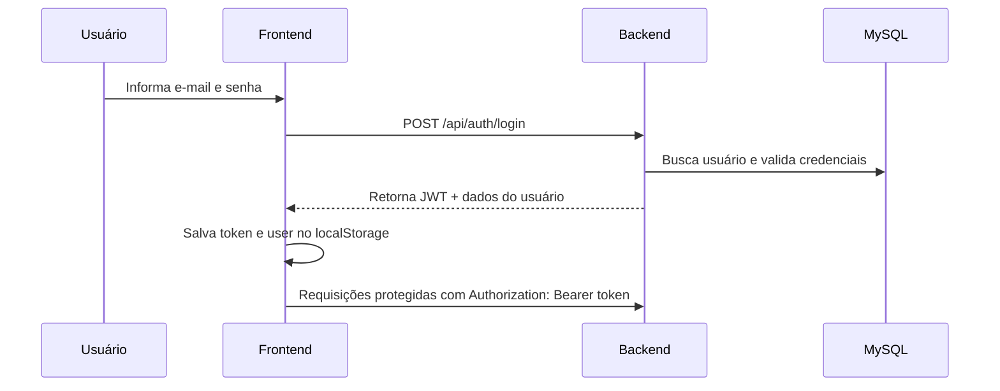
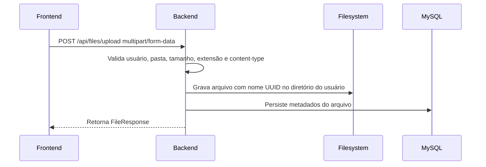

# Arquitetura

## Visão geral

O projeto usa uma arquitetura web cliente-servidor em monorepo, com frontend React/Vite separado do backend Spring Boot. O backend centraliza regras de negócio, autenticação, persistência de metadados e gravação física dos arquivos.



## Separação de responsabilidades

| Camada | Responsabilidade |
|---|---|
| Frontend | Interface, navegação, formulários, chamadas HTTP, armazenamento local do token e feedback visual. |
| Backend Controllers | Entrada HTTP, validação inicial via DTOs e delegação para services. |
| Backend Services | Regras de negócio, validação de propriedade do usuário, upload, favoritos, lixeira e KPIs. |
| Repositories | Consultas e persistência JPA. |
| Banco MySQL | Persistência de usuários, pastas e metadados de arquivos. |
| Filesystem local | Armazenamento físico dos arquivos enviados. |

## Fluxo básico de autenticação



## Fluxo básico de upload



## Fluxo de navegação por pastas

```mermaid
flowchart TD
    A[Frontend em /drive] --> B[GET /api/folders]
    A --> C[GET /api/files]
    A --> D{Existe folderId na rota?}
    D -->|Sim| E[GET /api/folders/{id}/contents]
    D -->|Não| F[Filtra pastas e arquivos sem parent/folder]
    E --> G[Renderiza subpastas e arquivos da pasta]
    F --> H[Renderiza raiz do drive]
```

A rota frontend usa IDs de pastas no path, por exemplo `/drive/1/2`. O backend não recebe a trilha completa, apenas o ID atual quando o frontend chama `/folders/{id}/contents`.

## Integrações internas

- `FilesPage.jsx` integra diretamente com `/files`, `/folders`, `/files/search`, `/files/trash`, `/files/upload`, `/files/{id}/download` e endpoints de favoritos.
- `Favorites.jsx` usa `GET /favorites` e endpoints de desfavoritar.
- `Settings.jsx` usa endpoints de usuário e KPIs.
- `api.js` injeta JWT automaticamente nas requisições quando existe token em `localStorage`.

## Integrações externas

Não foram identificadas integrações externas com provedores de armazenamento, serviços de e-mail, filas, gateways de pagamento, SSO ou APIs de terceiros. O banco MySQL e o filesystem local são dependências de infraestrutura, não integrações externas de produto.

## Decisões arquiteturais identificadas

- Monorepo com frontend e backend separados.
- Backend stateless com JWT.
- Metadados em banco relacional e binários em filesystem local.
- Exclusão lógica de arquivos por flag `deleted`.
- Exclusão física de arquivos não identificada.
- Pastas hierárquicas com autorrelacionamento em `Folder.parentFolder`.
- Favoritos implementados como flag booleana em `FileEntity` e `Folder`.
- Criação/atualização de schema delegada ao Hibernate com `ddl-auto: update`.
- MySQL local via Docker Compose disponível no repositório.

## Limitações e pontos de atenção

- O armazenamento local não é distribuído; múltiplas instâncias do backend exigiriam volume compartilhado ou mudança para storage externo.
- Não foi identificado versionamento de schema com Flyway/Liquibase.
- Não foi identificada política de backup para banco e arquivos físicos.
- Não foi identificado endpoint de restauração da lixeira.
- Não foi identificado endpoint de exclusão física definitiva.
- Não foi identificada autenticação com refresh token.
- Não foi identificado controle de permissões por papéis/perfis; o isolamento é por usuário proprietário dos recursos.
- O CORS está fixo para ambiente local de desenvolvimento.
