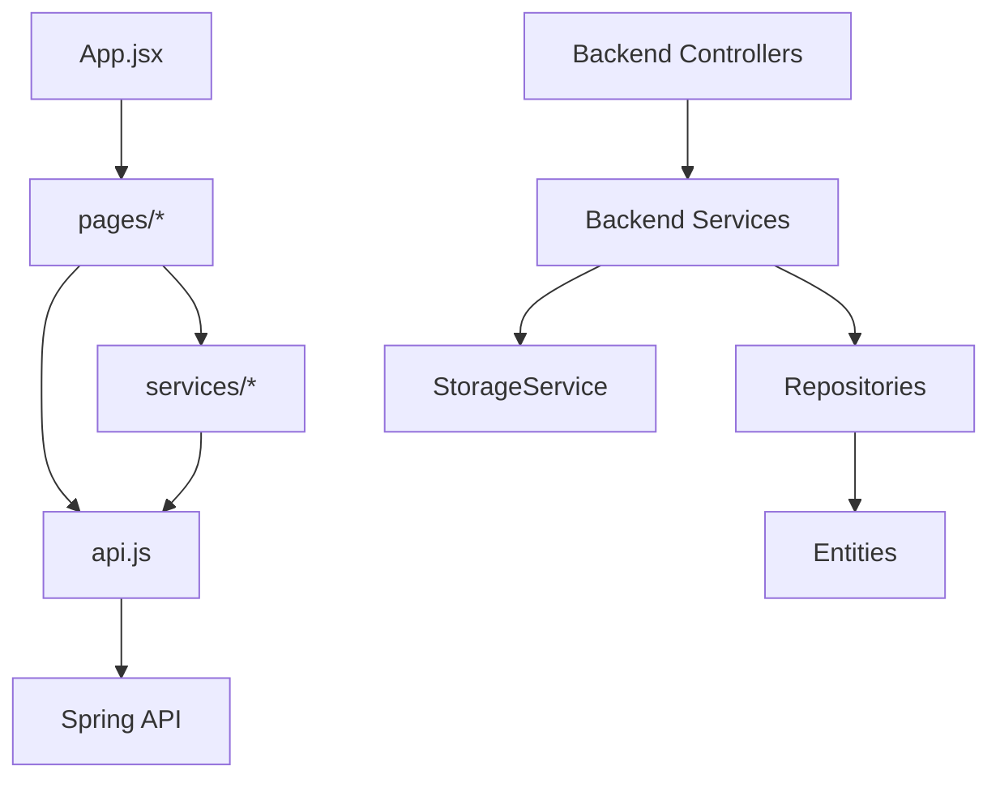

# Documentação técnica do código

## Pontos iniciais de leitura

Para entender o projeto no estado atual, a leitura recomendada é:

1. `README.md` da raiz.
2. `docker-compose.yml`.
3. `backend/src/main/resources/application.yml`.
4. `backend/src/main/java/com/company/drive/DriveApplication.java`.
5. Controllers em `backend/src/main/java/com/company/drive/controller/`.
6. Services em `backend/src/main/java/com/company/drive/service/`.
7. Entidades em `backend/src/main/java/com/company/drive/entity/`.
8. `frontend/src/App.jsx`.
9. `frontend/src/api.js`.
10. Páginas em `frontend/src/pages/`.

## Backend

### `DriveApplication.java`

Classe principal da aplicação Spring Boot. Habilita `StorageProperties` via `@EnableConfigurationProperties`, permitindo mapear `app.storage.path` para uma classe de configuração.

### `config/AuthenticationConfig.java`

Expõe o `AuthenticationManager` a partir de `AuthenticationConfiguration`, usado no fluxo de login.

### `config/StorageProperties.java`

Mapeia propriedades com prefixo `app.storage`. No estado atual, possui a propriedade `path`, usada pelo `StorageService` como diretório raiz de arquivos.

## Controllers

### `AuthController.java`

Endpoints públicos:

- `POST /api/auth/register`
- `POST /api/auth/login`

Responsável apenas por receber DTOs validados e delegar ao `AuthService`.

### `FileController.java`

Endpoints de arquivos:

- Upload multipart.
- Listagem de arquivos ativos.
- Busca por nome.
- Lixeira.
- Consulta por ID.
- Download.
- Exclusão lógica.
- Favoritar/desfavoritar.

Contém montagem da resposta de download com `Content-Disposition` e `Content-Type`.

### `FolderController.java`

Endpoints de pastas:

- Criar pasta.
- Listar pastas.
- Consultar pasta.
- Consultar conteúdo da pasta.
- Excluir pasta.
- Favoritar/desfavoritar.

A exclusão retorna mensagem indicando que arquivos foram enviados para a lixeira.

### `FavoriteController.java`

Expõe `GET /api/favorites`, delegando a agregação para `FavoriteService`.

### `UserController.java`

Endpoints do usuário atual:

- `GET /api/users/me`
- `PUT /api/users/me/profile`
- `PUT /api/users/me/email`
- `PUT /api/users/me/password`
- `GET /api/users/me/kpis`

## Services

### `AuthService.java`

Responsável por cadastro e login.

Pontos relevantes:

- Normaliza e-mail para minúsculas.
- Impede cadastro duplicado por e-mail.
- Usa BCrypt para senha.
- Usa `AuthenticationManager` no login.
- Gera JWT após autenticação.

### `CurrentUserService.java`

Responsável por obter o usuário autenticado no contexto atual. É usado pelos demais services para aplicar isolamento por usuário.

### `FileService.java`

Centraliza as regras de arquivo.

Responsabilidades:

- Upload com pasta opcional.
- Listagem de arquivos ativos.
- Busca por nome.
- Listagem de lixeira.
- Consulta por ID validando propriedade do usuário.
- Download do arquivo físico.
- Exclusão lógica.
- Favoritar/desfavoritar.

Método crítico: `ownedActive(Long id, User user)`, que impede acesso a arquivo excluído ou de outro usuário.

### `FolderService.java`

Centraliza regras de pasta.

Responsabilidades:

- Criar pasta raiz ou subpasta.
- Validar duplicidade de nome no mesmo nível.
- Listar pastas do usuário.
- Buscar conteúdo direto da pasta.
- Excluir hierarquia de pastas.
- Favoritar/desfavoritar.
- Validar propriedade da pasta.

Métodos críticos:

- `getOwned(Long id, User user)` para isolamento por usuário.
- `collectFolders(...)` para montar hierarquia durante exclusão.
- `delete(Long id)` para mover arquivos ativos da hierarquia para lixeira e excluir pastas.

### `StorageService.java`

Responsável pela interação com o filesystem.

Responsabilidades:

- Criar diretório raiz no startup.
- Criar diretório por usuário.
- Validar nome do arquivo contra path traversal.
- Validar extensão e content-type.
- Validar limite de 50 MB.
- Salvar arquivo com UUID.
- Carregar arquivo como `Resource` para download.

Ponto crítico: valida `startsWith(root)` e `startsWith(userDir)` para reduzir risco de gravação fora do diretório configurado.

### `FavoriteService.java`

Agrega favoritos do usuário atual:

- Pastas favoritas.
- Arquivos favoritos ativos, ou seja, não excluídos logicamente.

### `UserService.java`

Responsável por dados e manutenção da conta:

- Retorna usuário atual.
- Atualiza nome.
- Atualiza e-mail com validação de senha atual e duplicidade.
- Altera senha com validação de senha atual e confirmação.
- Calcula KPIs de arquivos, pastas e armazenamento usado.

## Security

### `SecurityConfig.java`

Define autenticação stateless com JWT. Libera `/api/auth/**` e exige autenticação para os demais endpoints.

### `JwtService.java`

Gera e valida tokens JWT. Exige segredo de no mínimo 32 caracteres. Usa expiração configurável por `jwt.expiration`.

### `JwtAuthenticationFilter.java`

Filtro de autenticação JWT. Não foi necessário copiar o código para esta documentação; sua responsabilidade é ler o token da requisição, validar e popular o contexto de segurança.

### `ApiSecurityErrorHandler.java`

Tratamento de erros de autenticação/autorização na camada de segurança.

### `UserDetailsServiceImpl.java`

Carrega usuário para autenticação. Deve ser analisado junto a `UserRepository` em mudanças de autenticação.

## DTOs

Os DTOs separam entrada/saída da API. Principais grupos:

- Autenticação: `RegisterRequest`, `LoginRequest`, `LoginResponse`, `UserResponse`.
- Arquivos: `FileResponse`.
- Pastas: `FolderRequest`, `FolderResponse`, `FolderContentsResponse`.
- Favoritos: `FavoritesResponse`.
- Usuário: `CurrentUserResponse`, `UpdateProfileRequest`, `UpdateEmailRequest`, `ChangePasswordRequest`, `UserKpiResponse`.
- Mensagens: `MessageResponse`.

## Frontend

### `main.jsx`

Ponto de entrada do React. Importa Bootstrap, CSS global, `BrowserRouter` e `App`.

### `App.jsx`

Define as rotas da aplicação e a proteção básica com `PrivateRoute` usando `localStorage.getItem('token')`.

### `api.js`

Cria instância Axios com base URL configurável por `VITE_API_URL`. Interceptor adiciona `Authorization: Bearer <token>` quando o token existe no `localStorage`.

### `pages/LoginPage.jsx`

Formulário de login. Chama `POST /auth/login`, salva token e usuário e navega para o drive.

### `pages/RegisterPage.jsx`

Formulário de cadastro. Valida confirmação de senha no frontend e chama `POST /auth/register`.

### `pages/FilesPage.jsx`

Componente mais complexo do frontend. Concentra:

- Carregamento de arquivos e pastas.
- Navegação por rota e breadcrumbs.
- Upload com progresso.
- Criação de pasta.
- Busca.
- Recentes.
- Lixeira.
- Download.
- Favoritos.
- Exclusão de arquivos e pastas.
- Modal/painel de detalhes.
- Mensagens de erro e sucesso.

### `pages/Favorites.jsx`

Tela de favoritos. Consome `GET /favorites` e permite remover favoritos e baixar arquivos.

### `pages/Settings.jsx`

Tela de conta. Consome endpoints de usuário e KPIs. Atualiza nome, e-mail e senha.

### `components/*`

Componentes auxiliares das telas de autenticação:

- `AuthCard.jsx`
- `AuthLayout.jsx`
- `InputField.jsx`
- `LoadingButton.jsx`

## Dependências internas relevantes

## Pontos críticos do código

- `FilesPage.jsx` concentra muitas regras de UI e chamadas HTTP.
- `StorageService.java` é crítico para segurança de upload e path traversal.
- `FolderService.delete` altera arquivos e pastas em cascata lógica/relacional.
- `JwtService` depende de segredo seguro e tamanho mínimo.
- `SecurityConfig` define a fronteira de autorização da API.
- `application.yml` contém defaults úteis para local, mas sensíveis para ambientes reais.

## Itens não identificados

- Testes unitários ou de integração implementados.
- Camada de mapper dedicada além dos métodos `from` em DTOs.
- Documentação OpenAPI/Swagger.
- Serviço de storage externo.
- Tratamento centralizado de estado no frontend.
