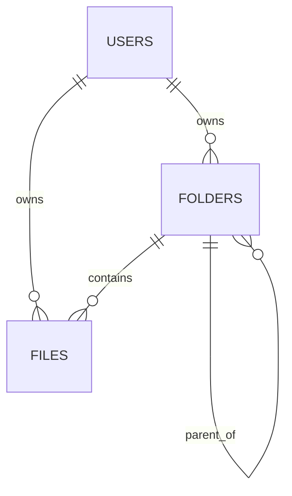

# Banco de dados

## Tipo de banco

O projeto usa **MySQL**. O `docker-compose.yml` configura a imagem `mysql:8.4` para desenvolvimento local.

## Configuração de conexão

O backend usa Spring Data JPA/Hibernate com as seguintes configurações:

```yaml
spring:
  datasource:
    url: ${DB_URL:jdbc:mysql://localhost:3306/drive_corporativo}
    username: ${DB_USERNAME:root}
    password: ${DB_PASSWORD:root}
  jpa:
    hibernate:
      ddl-auto: update
    show-sql: true
```

O banco padrão é `drive_corporativo`.

## Script SQL identificado

Arquivo: `mysql/init.sql`.

Função: criar o banco caso ele não exista.

```sql
CREATE DATABASE IF NOT EXISTS drive_corporativo
  CHARACTER SET utf8mb4
  COLLATE utf8mb4_unicode_ci;
```

Não foram identificadas migrations versionadas com Flyway, Liquibase ou ferramenta equivalente.

## Estratégia de persistência

A aplicação usa entidades JPA e `ddl-auto: update`, ou seja, o Hibernate cria/atualiza o schema automaticamente com base nas entidades.

Essa estratégia é prática para desenvolvimento local, mas tem risco em ambientes compartilhados ou produção porque alterações de schema não ficam versionadas em scripts auditáveis.

## Entidades/tabelas identificadas

### `users`

Entidade: `User`.

| Campo | Tipo Java | Restrições identificadas |
|---|---|---|
| `id` | `Long` | Chave primária, `IDENTITY`. |
| `name` | `String` | Obrigatório, tamanho 120. |
| `email` | `String` | Obrigatório, tamanho 190, único. |
| `password` | `String` | Obrigatório, senha criptografada. |
| `createdAt` | `LocalDateTime` | Obrigatório, definido em `@PrePersist`, não atualizável. |
| `updatedAt` | `LocalDateTime` | Atualizado em `@PrePersist` e `@PreUpdate`. |

### `folders`

Entidade: `Folder`.

| Campo | Tipo Java | Restrições identificadas |
|---|---|---|
| `id` | `Long` | Chave primária, `IDENTITY`. |
| `name` | `String` | Obrigatório, tamanho 150. |
| `parent_folder_id` | `Folder` | Relacionamento opcional com outra pasta. |
| `user_id` | `User` | Obrigatório. |
| `favorite` | `boolean` | Obrigatório, default false. |
| `createdAt` | `LocalDateTime` | Obrigatório, definido em `@PrePersist`, não atualizável. |
| `updatedAt` | `LocalDateTime` | Obrigatório, atualizado em `@PrePersist` e `@PreUpdate`. |

### `files`

Entidade: `FileEntity`.

| Campo | Tipo Java | Restrições identificadas |
|---|---|---|
| `id` | `Long` | Chave primária, `IDENTITY`. |
| `originalName` | `String` | Obrigatório. |
| `stored_name` | `String` | Obrigatório, único. |
| `extension` | `String` | Obrigatório, tamanho 12. |
| `contentType` | `String` | Obrigatório. |
| `size` | `Long` | Obrigatório. |
| `storagePath` | `String` | Obrigatório, tamanho 1000. |
| `folder_id` | `Folder` | Opcional. |
| `user_id` | `User` | Obrigatório. |
| `deleted` | `boolean` | Obrigatório, default false no Java. |
| `favorite` | `boolean` | Obrigatório, default false. |
| `createdAt` | `LocalDateTime` | Obrigatório, definido em `@PrePersist`, não atualizável. |
| `updatedAt` | `LocalDateTime` | Obrigatório, atualizado em `@PrePersist` e `@PreUpdate`. |

## Relacionamentos



Descrição:

- Um usuário possui várias pastas.
- Um usuário possui vários arquivos.
- Uma pasta pode possuir subpastas por autorrelacionamento.
- Um arquivo pode estar associado a uma pasta ou ficar na raiz quando `folder_id` é nulo.

## Consultas/regras de persistência identificadas

### Usuários

- Buscar por e-mail.
- Verificar se e-mail existe.
- Verificar se e-mail existe em outro usuário durante alteração de e-mail.

### Pastas

- Listar por usuário.
- Listar subpastas por usuário e pasta pai.
- Listar favoritas.
- Verificar duplicidade de nome no mesmo nível.
- Contar pastas por usuário.

### Arquivos

- Listar arquivos ativos por usuário.
- Listar arquivos na lixeira por usuário.
- Listar arquivos por usuário e pasta.
- Listar arquivos de uma hierarquia de pastas.
- Buscar arquivo ativo por nome original.
- Listar favoritos ativos.
- Contar arquivos ativos.
- Somar bytes dos arquivos ativos.

## Armazenamento de arquivos

Os arquivos físicos não são armazenados no banco. O banco guarda metadados e o caminho físico em `FileEntity.storagePath`.

Fluxo identificado:

1. O backend resolve o diretório raiz de storage a partir de `app.storage.path`.
2. Para cada usuário, cria um subdiretório com o ID do usuário.
3. O arquivo é salvo com nome interno baseado em UUID e extensão original.
4. O nome original é mantido no banco em `originalName`.
5. Download usa `storagePath` para localizar o arquivo físico e `originalName` para o nome do anexo.

## Migrations e seeds

- Migrations versionadas: não identificado no repositório.
- Seeds de dados da aplicação: não identificado no repositório.
- Script de criação do banco: identificado em `mysql/init.sql`.

## Pontos de atenção

- `ddl-auto: update` pode mascarar alterações de schema e não substitui migrations versionadas.
- A consistência entre banco e filesystem depende de ambos serem preservados. Backup apenas do MySQL não recupera arquivos físicos.
- A exclusão de arquivo é lógica no banco; o arquivo físico permanece no filesystem pelo fluxo identificado.
- A exclusão de pasta remove registros de pasta, move arquivos para lixeira lógica e zera o vínculo com pasta.
- O diretório `storage/` aparece no repositório; é recomendável evitar versionar uploads reais.
- Não foi identificado controle transacional envolvendo rollback de arquivo físico caso a persistência no banco falhe após gravação do arquivo.
